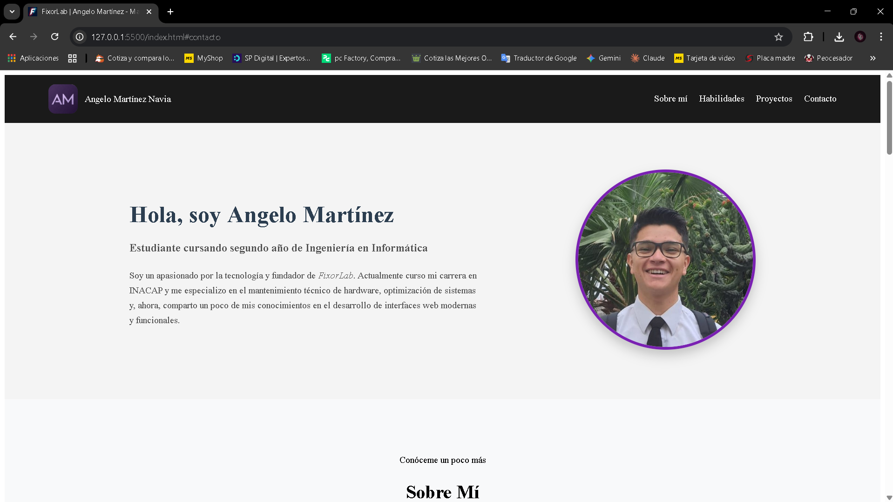
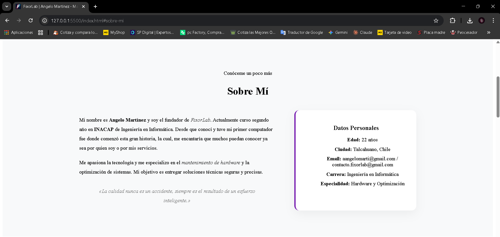
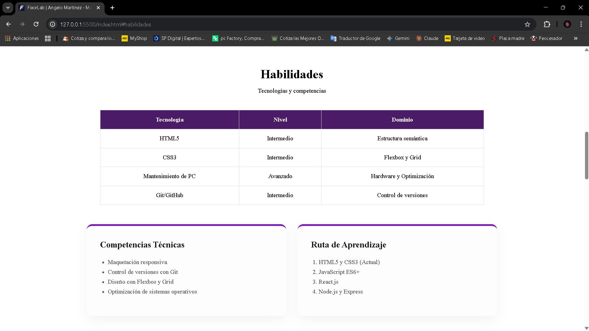
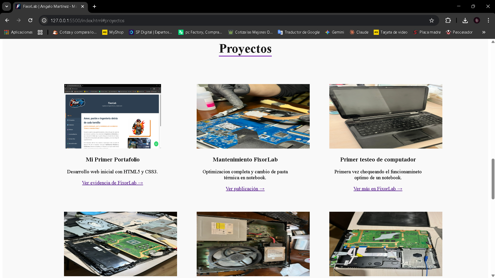
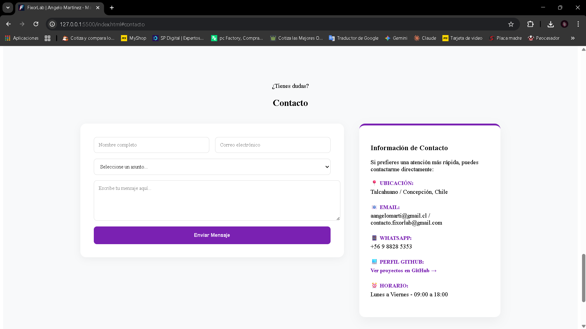

# FixorLab - Portafolio de Servicios Técnicos 🚀

## 📝 Descripción
Este proyecto es un portafolio personal desarrollado para una evaluación académica de la carrera de **Ingeniería en Informática**. El sitio tiene como objetivo presentar mi perfil como estudiante, mis intereses técnicos y las competencias adquiridas en el desarrollo de interfaces web modernas.

A través de esta página, doy visibilidad a mi pasión por la tecnología y a mi iniciativa personal, **FixorLab**, utilizándola como el eje central para demostrar habilidades en mantenimiento de hardware y optimización de sistemas. Es un espacio que combina mi formación académica en **INACAP** con mis proyectos prácticos..

## 🛠️ Tecnologías Utilizadas
Para el desarrollo de este proyecto se aplicaron estándares modernos de desarrollo web front-end:

* **HTML5:** Uso de etiquetas semánticas (`<header>`, `<nav>`, `<section>`, `<article>`, `<aside>`, `<footer>`) para mejorar el SEO y la accesibilidad.
* **CSS3:** Estilizado avanzado mediante:
    * **Flexbox:** Para la alineación de elementos en el header, secciones y contacto dual.
    * **CSS Grid:** Para la galería de proyectos responsiva.
    * **Media Queries:** Adaptabilidad total del diseño para dispositivos móviles (Responsive Design).
* **Git & GitHub:** Control de versiones con un historial de commits detallados.

## 📸 Capturas de Pantalla
A continuación se muestran los módulos principales del sitio:

### Vista Principal (Presentación)


### Sección Sobre Mí y Datos Personales


### Sección acerca de mis Habilidades


### Galería de Proyectos (Responsive)


### Formulario de Contacto y Datos Directos


## 🚀 Cómo Ejecutar el Proyecto
Para visualizar este proyecto en un entorno local, siga estas instrucciones:

1.  **Clonar el repositorio:**
    Abra una terminal y ejecute el siguiente comando:
    ```bash
    git clone [https://github.com/Angeleto0720/Prueba.git](https://github.com/Angeleto0720/Prueba.git)
    ```
2.  **Entrar a la carpeta:**
    ```bash
    cd Prueba
    ```
3.  **Ejecutar:**
    Localice el archivo `index.html` en la raíz del proyecto y ábralo con su navegador de preferencia (Chrome, Edge, Firefox, etc.).

---
**Autor:** Angelo Martínez Navia  
**Institución:** INACAP  
**Carrera:** Ingeniería en Informática